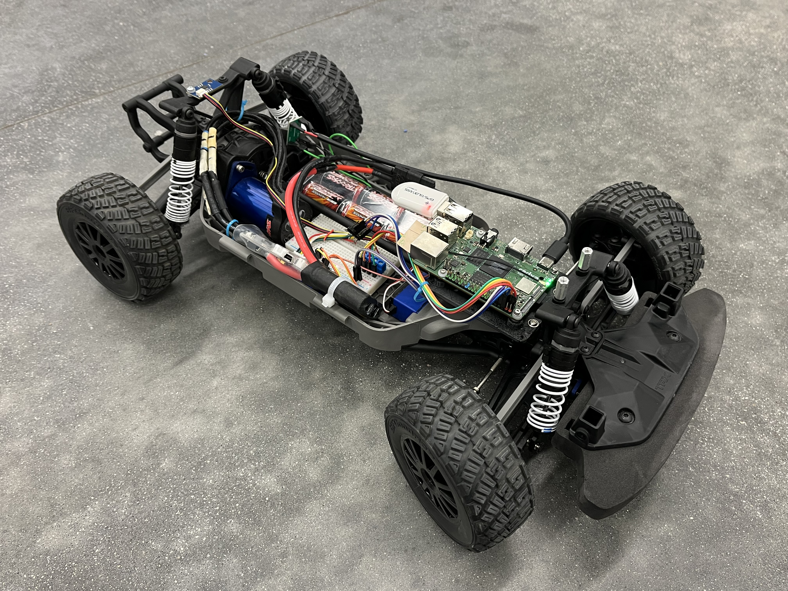
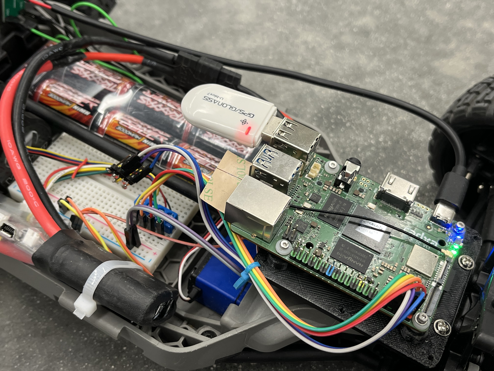
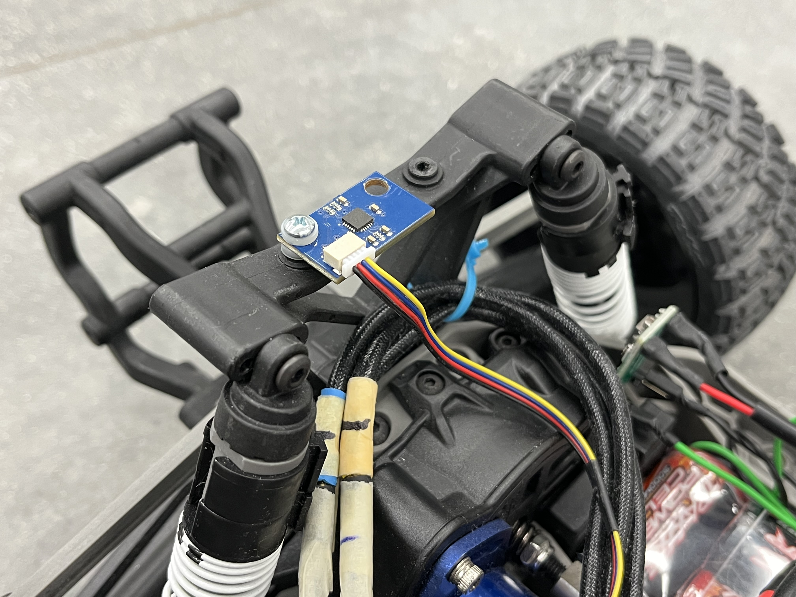
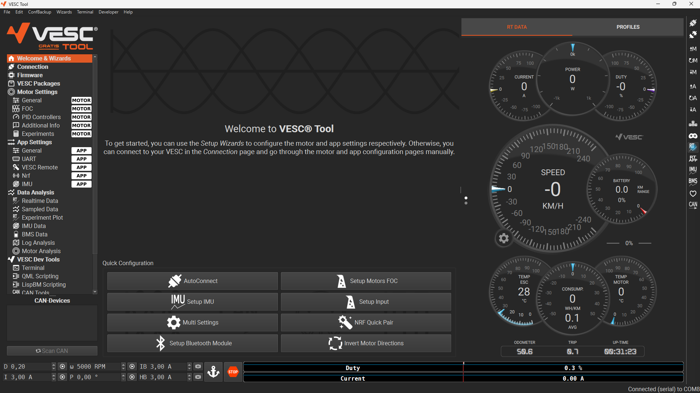
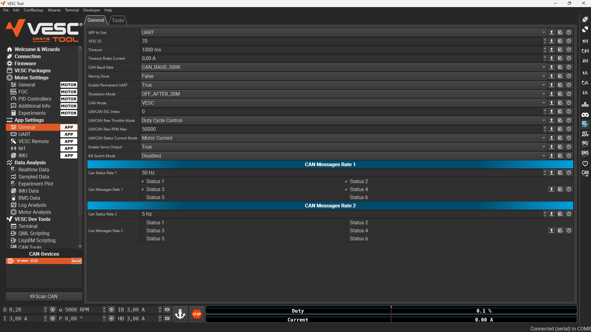
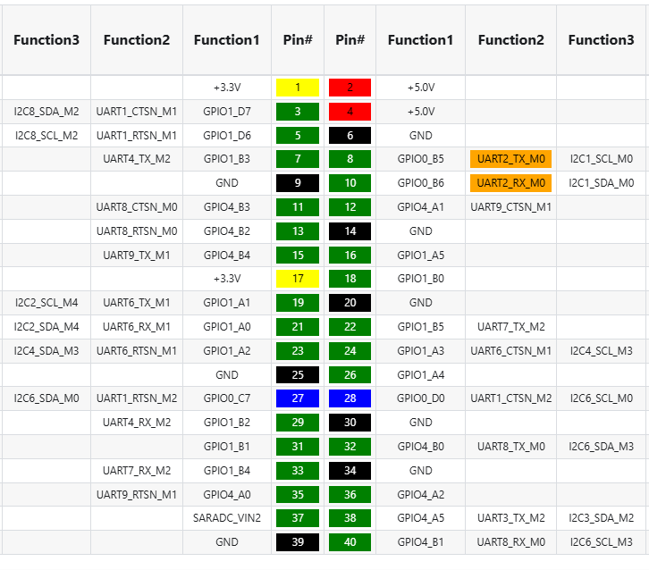

# GPS Autonomous Robot

A 5-week independent study project exploring GPS/IMU sensor fusion for precise localization on a small autonomous ground vehicle, with trajectory control as a follow-up application.

## Project Goals

**Primary**: Improve GPS positional accuracy by fusing GPS data with IMU measurements.

**Secondary**: Implement trajectory tracking/control using the fused localization output.

**Long-term (optional)**: Add camera and LiDAR for full autonomous navigation.

## Platform





**Compute**: Radxa Rock5C (RK3588S)

**Robot**: 4-wheeled RC car frame
- Ackermann front-wheel steering (servo)
- All-wheel drive via central BLDC motor
- Differential per axle

## Sensors

| Sensor | Interface | Role | Wiring |
|--------|-----------|------|------|
| u-blox 7 USB GPS dongle | USB | Absolute position (GNSS) | USB port |
| MPU-6050 | I2C8 | Linear acceleration + angular velocity | SDA (Pin3) + SCL (Pin5) |

## Actuators
| Component | Interface | Role | Wiring |
|--------|-----------|------|------|
VESC | UART2 | Motor control | Pin8 (TX) + Pin10 (RX) |
Steering Servo | PWM | Steering | Connected to VESC PWM output pins |

## Motor Controller (VESC)

The BLDC motor and steering servo are controlled by a VESC motor controller, configured via [VESC Tool](https://vesc-project.com/) — an open-source GUI application that connects over USB or UART. Key settings include motor type (BLDC), current limits, and servo output range.




## Software Stack

- **OS**: Linux (Rock5C)
- **Middleware**: ROS2
- **Sensor fusion**: -TBD-
- **GPS driver**: -TBD-
- **IMU driver**: -TBD-

## Architecture (planned)

-TBD-

## Project Structure

```
gps_autonomous_robot/
├── 01_Documents/          # Reports and references
└── README.md
```

## Status

- [x] Hardware platform selected
- [x] Hardware assembly
- [ ] ROS2 environment setup on Rock5C
- [ ] GPS driver integration & testing
- [ ] IMU driver integration & testing
- [ ] EKF sensor fusion tuning
- [ ] Trajectory controller implementation
- [ ] Field testing

# Hardware Setup


# Software Setup
## Activating hardware overlays
I2C8 and UART2 have to be activated with rsetup 

## Add user to group to access serial port
sudo usermod -aG dialout radxa

## Allow reading controller data
The PS4 controller is accessed via `/dev/hidraw0`. By default only root can open it, so a udev rule is needed:

```bash
sudo tee /etc/udev/rules.d/99-hidraw-plugdev.rules <<'EOF'
KERNEL=="hidraw*", SUBSYSTEM=="hidraw", GROUP="plugdev", MODE="0660"
EOF
sudo udevadm control --reload-rules && sudo udevadm trigger
```

Replug the controller afterwards. The `radxa` user is already in `plugdev`, so no further group changes are needed.

## Fix missing PyCRC dependency for pyvesc
The `pyvesc` package requires a `PyCRC` library that is no longer available on PyPI (the name was taken over by an unrelated package). A compatibility shim must be created manually:

```bash
mkdir -p ~/.local/lib/python3.11/site-packages/PyCRC
```

Create `~/.local/lib/python3.11/site-packages/PyCRC/__init__.py` (empty) and `CRCCCITT.py` implementing CRC-CCITT (XModem, poly=0x1021, init=0x0000).

## ROS2 Humble Installation (pre-built archive for Rock5C)

The following steps apply when using the pre-built `ros2_humble.tar.gz` archive (built for the `radxa` user on Rock5C). A standard `sudo apt install ros-humble-*` will not work on this board.

**1. Extract to the correct location**

The archive contains hardcoded paths for `/home/radxa/ros2_humble`. Extract it there:

```bash
sudo tar -xzf /path/to/ros2_humble.tar.gz -C /home/radxa/
```

Do **not** extract to `/home/` directly — the Python egg-link files will point to the wrong paths and ROS2 will fail to start.

**2. Install missing system libraries**

```bash
sudo apt install -y libspdlog-dev python3-packaging python3-dev python3-netifaces
```

**3. Install missing Python module**

```bash
pip install lark --break-system-packages
```

This is required for `ros2 launch` to work.

**4. Source the setup file**

```bash
source ~/ros2_humble/install/setup.bash
```

Add to `~/.bashrc` to make it permanent.

**5. Verify**

```bash
ros2 launch --help
```

## Notes

- MPU-6050 provides 6-DOF (accel + gyro), no magnetometer
